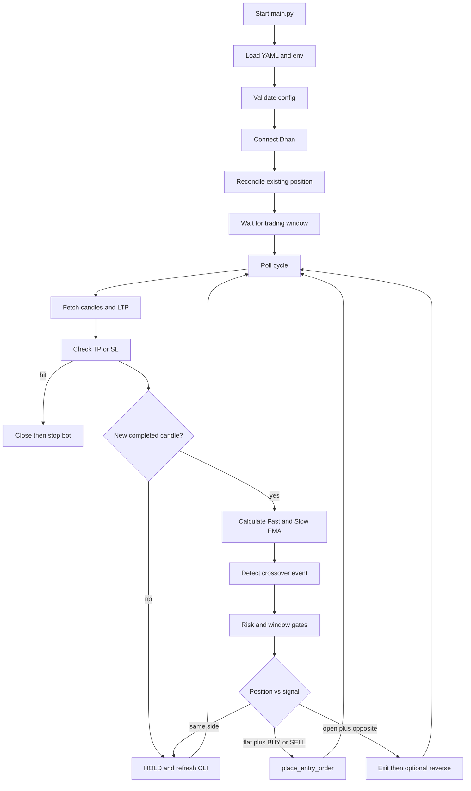

# EMA Crossover Algo

A configuration-driven, single-process Dhan bot that trades one NSE equity on **completed** candles using a Fast EMA / Slow EMA crossover. This document is the technical chapter for the implementation in `main.py`. It explains the idea, the mathematics, the broker path, the safety rules, and how to operate the program on a 1 GB Linux VM.

**No trading strategy can guarantee profit.** Historical performance is not a guarantee. Live execution differs from backtests. Slippage, brokerage, taxes, liquidity, and gaps matter. Parameters should be validated with out-of-sample testing. Risk management is essential. The objective is a robust, configurable engine, not a guaranteed-profit system.

---

## 1. Strategy Overview

An **exponential moving average (EMA)** is a smoothed series of price that gives more weight to recent closes than a simple moving average of the same length.

**Why EMA is used**

- It reacts faster than an SMA of the same period, so a change in direction shows up earlier.
- It is still a lagging filter. It does not predict the next tick.
- Two EMAs of different lengths create a *relationship* that can flip from “fast below slow” to “fast above slow”. That flip is the crossover.

**Fast EMA**

A shorter period (default 9). It hugs recent closes. It is noisier.

**Slow EMA**

A longer period (default 21). It represents a broader recent trend. It is slower to turn.

**Crossover**

A crossover is an **event**, not a standing condition. `fast > slow` on every 5-second poll is **not** a new signal. `detect_crossover()` requires two completed bars:

```text
Bullish: previous Fast <= previous Slow  AND  current Fast > current Slow
Bearish: previous Fast >= previous Slow  AND  current Fast < current Slow
```

**Bullish crossover** — Fast has just moved above Slow. The sample strategy treats this as a long/BUY event when longs are enabled.

**Bearish crossover** — Fast has just moved below Slow. With only longs enabled this is an EXIT of an existing long. With shorts enabled it can be a short/SELL event.

**Trend-following nature**

This is a trend-following rule. It tries to participate after a turn has already started. It is late by construction. That is the trade-off for ignoring a lot of mid-range noise.

**Strengths**

- Simple, inspectable math.
- Few knobs: two periods, one timeframe.
- Easy to paper-test and to explain on the CLI.

**Weaknesses**

- Whipsaws in a range (many crosses, little follow-through).
- Late entries and late exits in a sharp V-turn.
- No volume, volatility, or higher-timeframe filter in this build.
- Software TP/SL is polled on LTP, not an exchange stop.

The same completed candle is processed once (`last_processed_candle`). The forming candle is used only for display/LTP, never for a new crossover.

---

## 2. Strategy Logic

### Formula

```text
α = 2 / (N + 1)
EMA[t] = Price[t] × α  +  EMA[t−1] × (1 − α)
```

`N` is the period (`strategy.ema.fast_period` or `slow_period`). A larger `N` means a smaller `α` and a slower EMA.

This implementation **seeds** the first EMA value with an SMA of the first `N` closes, then applies the recurrence. That matches the usual textbook seed and is the same helper used by the MACD sibling bot. Early bars stay `None` until the seed exists.

`calculate_ema()` is pure Python. Pandas is not used, so a 1 GB VM does not pay for a dataframe on every poll.

### Signal mapping (`generate_signal()`)

| Position | Crossover | Return |
|----------|-----------|--------|
| Any / flat | none | `HOLD` |
| Flat | bullish | `BUY` |
| Flat | bearish | `SELL` |
| Long | bearish | `EXIT` |
| Short | bullish | `EXIT` |

`generate_signal()` never calls Dhan. Orders happen only after `validate_trade()` or `handle_exit_or_reverse()`.

### Long-only (default)

```text
enable_long: true
enable_short: false
```

- Bullish crossover + `validate_trade()` → BUY.
- Bearish crossover while long → EXIT (flatten). No short is opened.

### Short enabled

```text
enable_short: true
```

- Bearish crossover while flat → SELL/short.
- Bullish crossover while short → EXIT (cover).

### Reverse (`strategy.reverse_on_signal`)

If true, an `EXIT` close is followed by an entry on the opposite side **only when**:

1. The close is confirmed (local state is FLAT).
2. The opposite side is enabled.
3. `validate_trade()` allows the new entry (session, risk, unexpected-position checks).

If the close fails, reverse is skipped. The bot does not stack a second position.

### Re-entry (`strategy.allow_reentry`)

Default `false`. A second entry of the same direction is blocked while `last_signal_consumed` still equals that signal. An opposite crossover / confirmed exit clears that flag. A **new** opposite-then-same crossover is a new event and may trade again, subject to max trades and cooldown.

### Completed candles only

`get_market_data()` drops the in-progress bar (`_is_candle_complete()`). Intra-candle EMA flicker cannot open and close the same trade every 5 seconds.

---

## 3. Example Trade

These numbers are **illustrative**. They are not a forecast. Actual results depend on execution, slippage, brokerage, taxes, liquidity, and market conditions.

```text
Capital     : ₹100,000
Instrument  : example stock
Timeframe   : 5 minutes
Quantity    : 25
Fast EMA    : 9
Slow EMA    : 21
Entry       : ₹1,000
TP mode     : percentage 2.0
SL mode     : percentage 1.0
```

### Candle sketch (closes only)

| Candle | Close | Fast EMA (idea) | Slow EMA (idea) | Event |
|--------|------:|----------------:|----------------:|-------|
| t−2 | 995 | 994 | 996 | Fast still below Slow |
| t−1 | 998 | 996 | 996.5 | previous Fast <= previous Slow |
| t | 1002 | 998 | 997 | current Fast > current Slow → **BUY** |

The bot does not trade because Fast is above Slow at `t+1`. It already acted on candle `t`.

### Entry and levels (LONG)

```text
Entry = ₹1,000
TP    = 1,000 × (1 + 0.02) = ₹1,020
SL    = 1,000 × (1 − 0.01) = ₹990
```

If take-profit is reached:

```text
Gross P&L = (1,020 − 1,000) × 25
          = ₹500
```

If stop-loss is reached:

```text
Gross P&L = (990 − 1,000) × 25
          = −₹250
```

If `risk.estimated_cost_per_trade` is 40, the CLI labels the result as an **estimate** (₹460 or −₹290). The program does not invent brokerage or tax tables.

For a SHORT at the same entry:

```text
TP = 1,000 × (1 − 0.02) = ₹980
SL = 1,000 × (1 + 0.01) = ₹1,010
Gross P&L at TP = (1,000 − 980) × 25 = ₹500
```

After a verified TP or SL the **process stops**. It does not hunt for a second trade.

Software-polled exits are not exchange stop orders. A gap can print through ₹1,020 or ₹990.

---

## 4. End-to-End Execution Flow

```text
START
 ↓
Load configuration (config.yaml)
 ↓
Load environment (.env)
 ↓
Validate configuration + live-trading locks
 ↓
Connect to Dhan (DhanContext + dhanhq)
 ↓
Check / adopt existing position
 ↓
Wait for startup / trading window
 ↓
Poll cycle (default 5 seconds)
 ↓
Fetch LTP + completed candles
 ↓
Calculate Fast / Slow EMA
 ↓
Detect crossover event (or HOLD)
 ↓
If in position: check TP / SL first (invalid LTP never exits)
 ↓
Check risk, window, cooldown, duplicates
 ↓
place_entry_order / place_exit_order / optional reverse
 ↓
Monitor position against the broker book
 ↓
TP/SL, session flatten, or stop.py
 ↓
Graceful shutdown
```



There is no database, Redis, Docker, or second process. `stop.py` only writes `.stop`.

---

## 5. Function-by-Function Explanation

This list matches `main.py`. Helpers with a leading underscore are grouped.

### Startup and configuration

| Function | Purpose | Inputs / output | When / why |
|----------|---------|-----------------|------------|
| `parse_cli_args()` | Optional `--config` path. | `argv` → namespace | `main()` |
| `load_config()` | Read YAML. No network. | Path → dict | Before validation |
| `validate_config()` | Fail before any order if EMA periods, quantity, clocks, or product/segment are illegal. `fast_period >= slow_period` is fatal. | Mutates config | Startup |
| `validate_safety_config()` | Live needs **both** `bot.dry_run: false` and `bot.allow_live_trading: true`. | Raises `SafetyError` | Startup |
| `load_environment()` | `DHAN_CLIENT_ID` / `DHAN_ACCESS_TOKEN`. Never logs tokens. | — | Startup |
| `is_dry_run()` / `is_live_mode()` | Dry-run is anything that is not fully unlocked live. | bool | Every order path |
| `normalize_timeframe()` | `5m` → `5`, `1D` → `DAY`. Dhan intervals: 1, 5, 15, 25, 60, DAY. | str | Config |
| `setup_logging()` | Stderr + in-memory event ring. Filters lines that mention tokens. | — | Startup |

Trading implication: a bad YAML never reaches `place_order`.

### Stop and time

| Function | Purpose |
|----------|---------|
| `consume_leftover_stop_file()` | Delete a stale `.stop` once at startup. |
| `stop_requested()` | `.stop` exists or SIGINT/SIGTERM. |
| `announce_manual_stop_if_needed()` | Prints `MANUAL STOP REQUEST RECEIVED` once. |
| `check_trading_window()` | Session clocks + weekend + `bot.enabled`. |
| `is_before_session_start()` / `is_after_stop_entry()` / `is_after_close_positions()` | Day-trading gates. Weekends do not auto-flatten. |
| `is_market_expected_open()` | Weekday and inside the session when hours are enabled. |
| `interruptible_sleep()` | 250 ms slices so `stop.py` is noticed quickly. |

If `trading_hours.enabled` is false there is **no** clock restriction.

### Dhan and market data

| Function | Purpose |
|----------|---------|
| `create_dhan_client()` | `DhanContext` when present; legacy fallback otherwise. |
| `get_market_data()` | `intraday_minute_data` or `historical_daily_data`. Drops the in-progress bar. Caps lookback. |
| `validate_candles()` | Rejects non-positive or inconsistent OHLC. |
| `get_ltp()` | `ticker_data`, ≥1.05 s apart. Keeps last good LTP on a blip. |
| `get_positions()` / `get_open_position()` | `None` on read failure so an API error is never treated as flat. |

### Indicators and signal

| Function | Purpose |
|----------|---------|
| `calculate_ema()` | SMA seed, then `α = 2/(N+1)`. |
| `detect_crossover()` | Event test on two completed bars. Returns BUY / SELL / HOLD. |
| `calculate_indicators()` | Fast and Slow series for one candle list. |
| `_store_ema_state()` | Copy current/previous EMA onto `BotState` for the CLI. |
| `generate_signal()` | BUY / SELL / EXIT / HOLD. **No Dhan calls.** |

### Risk, P&L, exits

| Function | Purpose |
|----------|---------|
| `calculate_stop_loss()` / `calculate_take_profit()` / `calculate_exit_levels()` | Percentage or points, rounded to tick. |
| `arm_risk_levels()` | Store TP/SL after a fill. Mode `disabled` leaves both off. |
| `update_trailing_stop()` | Optional. LONG: `highest × (1 − trail%)`. |
| `effective_stop_loss()` | More protective of fixed and trailing. |
| `calculate_pnl()` | LONG `(px − entry) × qty`. SHORT `(entry − px) × qty`. Gross. |
| `estimated_net_pnl()` | Subtracts `estimated_cost_per_trade` only when > 0, and labels it. |
| `check_risk_limits()` / `daily_risk_blocked()` | Max trades / daily loss / daily profit. `0` disables the daily halt. |
| `validate_trade()` | Vetoes a BUY/SELL entry. Never places an order. |
| `monitor_tpsl()` | SL (or trail) before TP. Zero/missing LTP never exits. |
| `exit_position(reason=...)` | Named exit used by the CLI. |
| `handle_exit_or_reverse()` | Opposite-crossover flatten, then optional reverse. |

### Orders

| Function | Purpose |
|----------|---------|
| `submit_order()` | **Only** `place_order` call site. Never retries on timeout. Recovers via tag `M…`. Dry-run returns `DRYRUN`. |
| `place_entry_order()` / `place_exit_order()` | Configured quantity and order type. |
| `finalize_submitted_order()` | Wait, interpret fill/reject/partial. Partials are not topped up. |
| `find_order_id_after_uncertain_place()` | Correlation ID then order book. |
| `close_all_positions()` | Only the configured security when `manage_only_*` is true. Never flattens an unknown holding. |
| `reconcile_state()` / `recover_existing_state()` | Broker book wins. Restart does not add a second entry. |

If ownership cannot be established safely, the bot stays in observation mode and warns. It does not blindly close a pre-existing position it did not create.

### Loop and CLI

| Function | Purpose |
|----------|---------|
| `process_new_candle()` | One completed bar → signal → entry, EXIT, or reverse. |
| `run_one_poll_cycle()` | Stop, flatten clock, pending order, reconcile, LTP, TP/SL, then candles. Open positions still get candle processing so an opposite cross can exit. |
| `run_trading_loop()` | Poll interval ≠ CLI refresh. |
| `graceful_shutdown()` | Stop entries, optional flatten, cancel pendings, print daily P&L. |
| `render_startup_banner()` / `render_dashboard()` / `render_exit_banner()` | Spec banners and in-place dashboard. |
| `main()` | Wire the above. Exit code 0/1. |

Dataclasses: `Candle`, `EmaPoint`, `BotState`. Exceptions: `ConfigError`, `SafetyError`, `CredentialError`.

---

## 6. Configuration Guide

Secrets stay in `.env`. Everything a trader may reasonably tune is in `config.yaml`.

| Parameter | Purpose | Example | Increasing / decreasing |
|-----------|---------|---------|-------------------------|
| `strategy.ema.fast_period` | Fast EMA length | 9 | Lower: more crosses, more noise. Higher: slower, fewer signals. |
| `strategy.ema.slow_period` | Slow EMA length | 21 | Lower: closer to fast (more crosses). Higher: broader trend, later. |
| `strategy.timeframe` | Candle size | `5m` | See tuning. Must be a Dhan interval. |
| `bot.polling_seconds` | Broker/API cycle | 5 | Faster polls do not create a faster strategy. They only check TP/SL more often. |
| `risk.take_profit` | TP distance | 2.0 | Larger: fewer TPs, bigger average win if hit. |
| `risk.stop_loss` | SL distance | 1.0 | Larger: fewer stops, bigger damage when wrong. |
| `risk.tp_sl_mode` | `percentage` / `points` / `disabled` | percentage | `disabled` exits only on crossover, session, or stop. |
| `instrument.quantity` | Order size | 1 | Linear on P&L and margin. |
| `execution.cooldown_seconds` | Pause after a trade | 60 | Higher: fewer clustered fills. |
| `risk.max_trades_per_day` | Daily entry cap | 5 | `0` disables the cap. Counted on confirmed entries. |
| `trading_hours.*` | Session gates | 09:20 / 15:00 / 15:15 | Disable the whole block with `enabled: false`. |
| `strategy.reverse_on_signal` | Close then flip | false | True only if the opposite side is enabled and the close confirms. |
| `strategy.allow_reentry` | Same-direction re-entry | false | False blocks repeating the last consumed signal. |
| `risk.max_daily_loss` | Halt if realized loss ≥ value | 0 | `0` disables. |
| `risk.max_daily_profit` | Halt if realized profit ≥ value | 0 | `0` disables. |
| `execution.enable_long` / `enable_short` | Direction gates | true / false | Both false is a config error. |
| `bot.dry_run` + `allow_live_trading` | Live lock | true / false | Both must unlock for a real order. |
| `shutdown.close_positions_on_manual_stop` | Flatten on `stop.py` | false | Spec default leaves the position open. |
| `position_management.manage_only_bot_positions` | Do not flatten other symbols | true | Safer default. |

Startup validation fails clearly and does not start trading if a value is illegal.

---

## 7. Parameter Tuning

### Fast EMA

Lower value: reacts faster, more signals, more noise.

Higher value: smoother, fewer signals, slower response.

### Slow EMA

Lower: reacts faster, stays closer to the fast line.

Higher: identifies a broader trend, later crosses.

### EMA combinations (examples, not optimal)

| Pair | Character |
|------|-----------|
| 5 / 20 | Fast, more whipsaw |
| 9 / 21 | Sample default |
| 12 / 26 | Classic MACD lengths without the signal line |
| 20 / 50 | Slower swing |
| 50 / 200 | Very slow; rare events on 5-minute bars |

These are examples, not guaranteed optimal settings.

### TP / SL

- Tight TP: more frequent exits, smaller average win, can chop a trend.
- Wide TP: fewer hits, larger win if the move continues.
- Tight SL: smaller average loss, more noise stops.
- Wide SL: fewer stops, larger damage.
- Risk/reward in the sample is 1% SL vs 2% TP (1:2) **before** costs. That is a starting point, not an edge.

### Timeframe

| Interval | Noise | Signal frequency | Holding period (typical idea) |
|----------|-------|------------------|-------------------------------|
| 1-minute | High | High | Minutes |
| 5-minute | Medium | Medium | Default for this bot |
| 15-minute | Lower | Lower | Tens of minutes to hours |
| 60-minute | Low | Low | Hours |
| DAY | Lowest | Rare | Multi-day (session window may not fit) |

Polling every 5 seconds does **not** create a 5-second strategy.

---

## 8. How to Improve the Strategy

Suggestions for robustness — not promises of profit. Adding filters may reduce false signals and can also reduce trade frequency and miss moves.

- Volume filter (skip thin bars).
- Higher-timeframe trend (only long if daily Fast > Slow).
- RSI confirmation.
- ATR-based stop instead of a fixed percent.
- Volatility filter (skip unusually quiet or chaotic sessions).
- VWAP filter (longs only above session VWAP).
- Market-regime filter (range vs trend).
- Trading-session filter (skip the first/last minutes).
- Slippage assumptions in any later backtest.
- Transaction-cost modeling.

Do not implement those here unless you extend `main.py` deliberately. This build is a clean two-EMA engine.

---

## 9. Backtesting

Backtest before live deployment. This repo does not ship a backtester. `calculate_ema()` and `detect_crossover()` are pure so you can replay completed candles later without touching `submit_order()`.

Discuss and avoid:

- **Transaction costs** — brokerage, STT, exchange, GST.
- **Slippage** — MARKET via API may be converted to limit-with-MPP.
- **Survivorship bias** — today’s symbols are not yesterday’s universe.
- **Look-ahead bias** — only use a bar after it is closed. This live bot already does that.
- **Overfitting** — do not grind 9/21 vs 8/22 on two weeks of data.
- **Walk-forward / out-of-sample** — tune on one window, test on a later one.

Historical performance is not a guarantee of live results.

---

## 10. Risk Management

| Control | Behaviour |
|---------|-----------|
| Position sizing | Fixed `instrument.quantity`. No auto-leverage. |
| Stop-loss | Armed after fill unless `tp_sl_mode: disabled`. |
| Daily loss / profit | Optional halt; optional flatten via `close_on_risk_limit`. |
| Max trades | Caps revenge trading after a sequence of crosses. |
| Cooldown | Blocks an immediate second entry. |
| One open position | `max_open_positions: 1` plus flat-before-entry. |
| Duplicate protection | Broker position, pending orders, in-flight flag, same-candle lock. |
| Dual live lock | Accidental `dry_run: false` is not enough. |

Avoid revenge trading (raising quantity after a loss). Avoid over-optimization. No configuration guarantees profit.

---

## 11. Live Trading Safety

- Run **dry_run first** on the same machine and hours you will use live.
- Start with a **small quantity**.
- API failures: reads retry a few times; `place_order` is never retried blindly.
- Order rejection: pending is cleared; no automatic resubmit.
- Network interruption: last good LTP is kept briefly; empty candles → wait.
- Broker mismatch: reconcile wins; unexpected other symbols can block entries.
- Duplicate orders: same candle, in-flight flag, correlation tag.
- Stale market data: invalid/zero LTP never triggers TP/SL.
- AWS restart: `recover_existing_state()` queries Dhan before any new entry.
- Manual intervention: `python3 stop.py` or Ctrl+C. Flatten only if configured.

Live **order** APIs need Dhan static-IP whitelist. Data APIs need an active data plan.

---

## 12. Example Scenarios

### A. Bullish crossover → BUY → TP

Flat. Candle closes with Fast crossing above Slow. `validate_trade()` passes. `place_entry_order()` fills. LTP later reaches TP. `monitor_tpsl()` returns `TAKE_PROFIT`. Position is closed. Banner prints. Bot **stops**.

### B. Bullish crossover → BUY → SL

Same entry. LTP trades through SL. `STOP_LOSS` is evaluated before TP if both are crossed in one gap. Position is closed. Bot **stops**.

### C. Bullish crossover → BUY → bearish crossover → EXIT

Long is open. A later completed bar prints Fast crossing below Slow. `generate_signal()` returns `EXIT`. `handle_exit_or_reverse()` flattens. `reverse_on_signal` is false (default), so no short. Bot keeps running and waits for a **new** bullish event (subject to max trades / cooldown).

### D. Long → bearish crossover → reverse to short

`enable_short: true` and `reverse_on_signal: true`. Close is confirmed FLAT, then `validate_trade()` is called for `SELL` (cooldown skipped so the same signal can flip). If the close failed, short is **not** opened.

### E. Trading window closes → close position

Weekday reaches `close_positions_time` (default 15:15). Poll returns `TRADING_DAY_END`. If `close_positions_on_session_end` is true, the bot-managed position is flattened and the process stops. If `trading_hours.enabled` is false, this clock is ignored.

### F. `stop.py` manually stops the bot

`.stop` is created. The loop prints `MANUAL STOP REQUEST RECEIVED`, stops new entries, and exits. Positions stay open unless `shutdown.close_positions_on_manual_stop` is true.

### G. API temporarily fails

Candle or position read fails. The cycle logs, marks API degraded, and waits for the next poll. No duplicate `place_order`. An API error is never treated as “flat”.

### H. Duplicate signal during polling

The same completed candle is seen on many 5-second polls. `last_processed_candle` matches → `WAITING_FOR_NEW_CLOSED_CANDLE`. EMA numbers refresh on the CLI. No second order.

---

## 13. P&L Calculation

**Unrealized (open position)**

```text
LONG  P&L = (LTP − average_entry) × quantity
SHORT P&L = (average_entry − LTP) × quantity
```

If Dhan reports unrealized P&L on the position row, `monitor_position()` prefers the broker value when present; otherwise it uses the formula above. The CLI must not mix realized and unrealized.

**Realized**

On a confirmed exit, the same formula uses the fill price. The result is added to `daily_realized_pnl`.

**Example**

Long 25 @ ₹1,000, LTP ₹1,010 → unrealized ₹250. After a TP fill at ₹1,020 → realized ₹500. Those are different numbers.

If `estimated_cost_per_trade` > 0, displayed totals are labelled as an estimate.

---

## 14. Operational Checklist

Before live trading:

```text
[ ] DHAN_CLIENT_ID and DHAN_ACCESS_TOKEN set in .env (never printed)
[ ] Token / data plan / profile checked
[ ] security_id verified for the intended symbol (do not guess)
[ ] quantity verified
[ ] product_type verified (CNC vs INTRADAY; F&O is not CNC)
[ ] EMA 9/21 (or your pair) and timeframe reviewed
[ ] TP / SL / tp_sl_mode reviewed
[ ] trading window or explicitly disabled
[ ] dry_run tested on a live session
[ ] risk limits (max trades, cooldown, daily loss) set
[ ] AWS / laptop clock is Asia/Kolkata or timezone matches YAML
[ ] Market hours understood
[ ] Network / static IP for live orders
[ ] python3 stop.py tested
[ ] Restart-with-open-position tested in dry-run
[ ] bot.dry_run: false AND bot.allow_live_trading: true set deliberately
```

---

## 15. Troubleshooting

| Symptom | What to check |
|---------|----------------|
| Authentication failure | `.env` values, token expiry, never paste the token into chat logs |
| Invalid security ID | Dhan security master; `2885` is RELIANCE equity only as a sample |
| No market data | Data plan, segment, timeframe, market hours, `DH-902` / `806` |
| Order rejected | Funds, product type, quantity, market closed, IP whitelist |
| Bot does not trade | CLI `WHY NO TRADE`: warmup, no cross, long/short disabled, window, cooldown, max trades, dry-run vs live lock |
| Repeated signal | Should not order twice; if it did, file a bug — same candle must be locked |
| Position mismatch | Reconcile cycle; do not flatten other symbols |
| TP/SL not triggered | `tp_sl_mode: disabled`, LTP missing/zero, or price never reached |
| `stop.py` not working | Run it from **this** directory; `main.py` must be running; leftover `.stop` is deleted on the *next* start |
| Configuration error | Read the exact `ERROR:` line; the process did not start |

---

## 16. Future Extensions

Possible later upgrades — **not** implemented:

- Multiple symbols
- Options
- Portfolio-level risk
- ATR / RSI / MACD as extra gates
- Machine learning or AI signal scoring
- A backtesting engine
- A database
- A web dashboard

Keep the six-file layout until you deliberately outgrow it.

---

## Learning and Extension Notes

Study the code in this order:

```text
strategy → data → signal → risk → order → position → exit
```

1. Read `calculate_ema()` and `detect_crossover()` with a notebook of closes.
2. Read `generate_signal()` — it only returns BUY / SELL / EXIT / HOLD.
3. Read `validate_trade()` — every reason the CLI can show.
4. Read `submit_order()` — the only live `place_order` call.
5. Read `process_new_candle()` and `handle_exit_or_reverse()`.
6. Read `monitor_tpsl()` and `graceful_shutdown()`.

To extend later, add a filter **inside** `generate_signal()` or a gate **inside** `validate_trade()`. Do not add a second `place_order` site. Do not persist secrets. Do not treat a poll as a new crossover.

The dashboard `WHY NO TRADE` line is the teaching aid: if you cannot explain the last decision from the panel, do not increase size.

---

## Commands

```bash
python3 main.py
python3 main.py --config config.yaml
python3 stop.py
```

## Live-mode reminder

Real orders require **both**:

```yaml
bot:
  dry_run: false
  allow_live_trading: true
```

Anything else stays dry-run even if market data is live.
